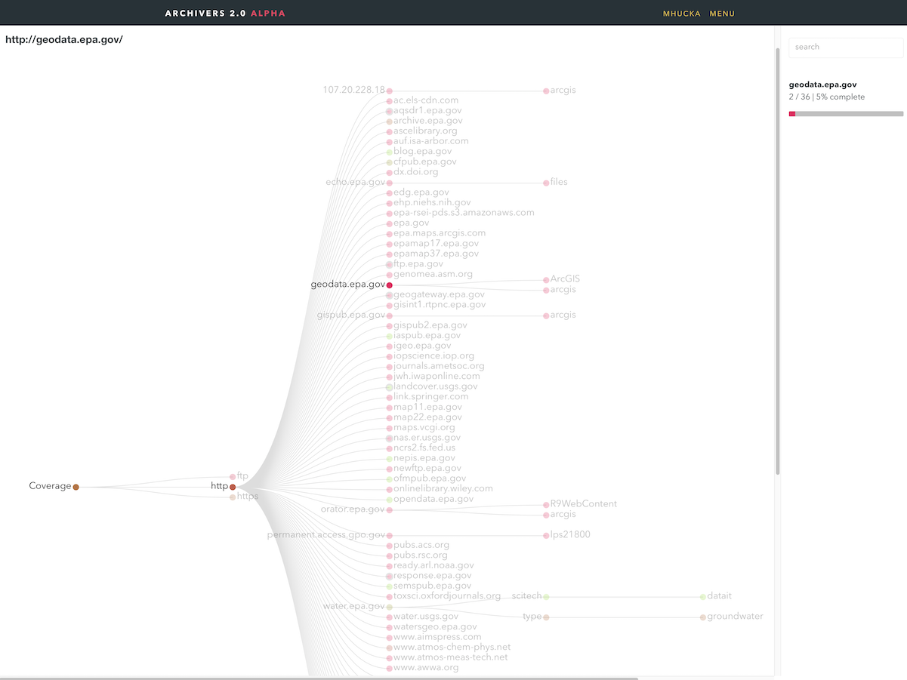
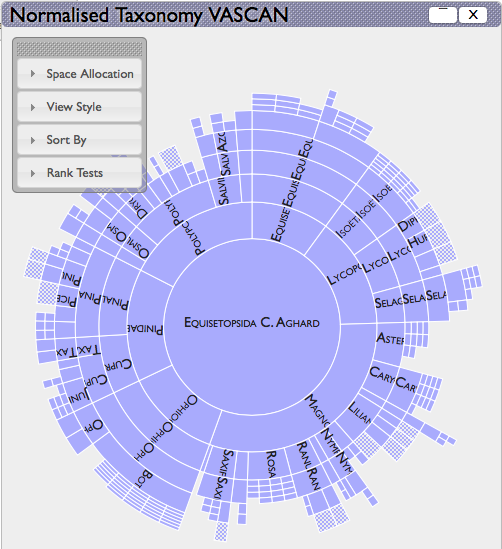
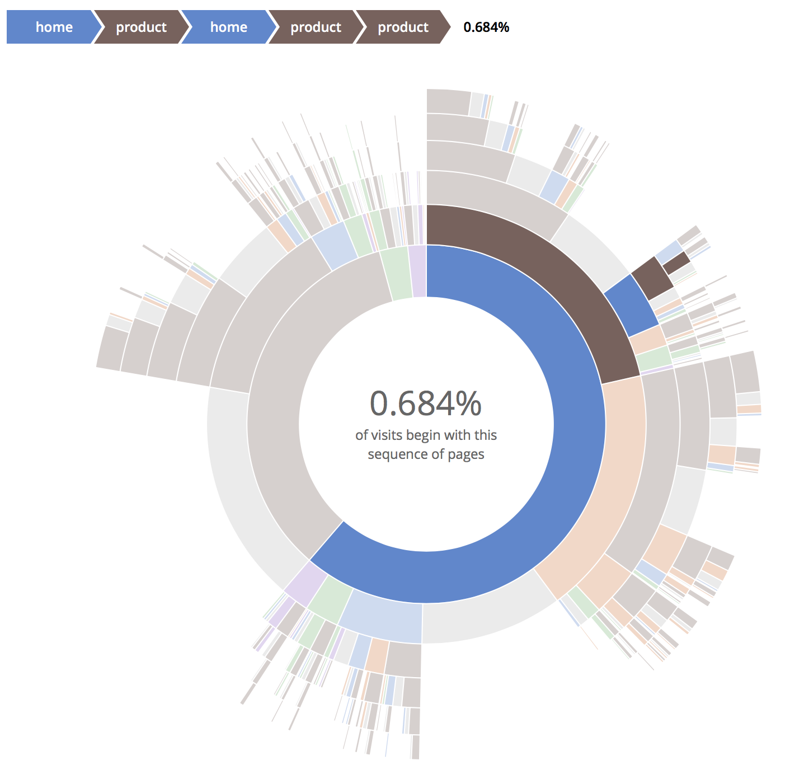
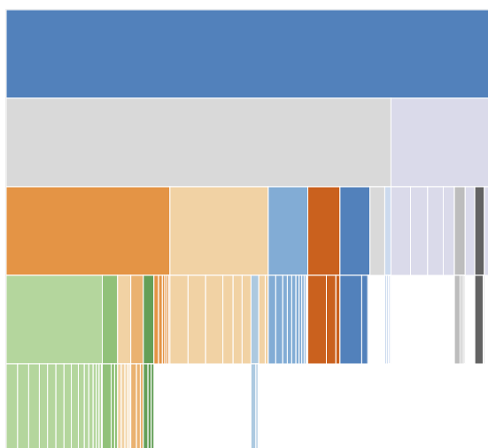
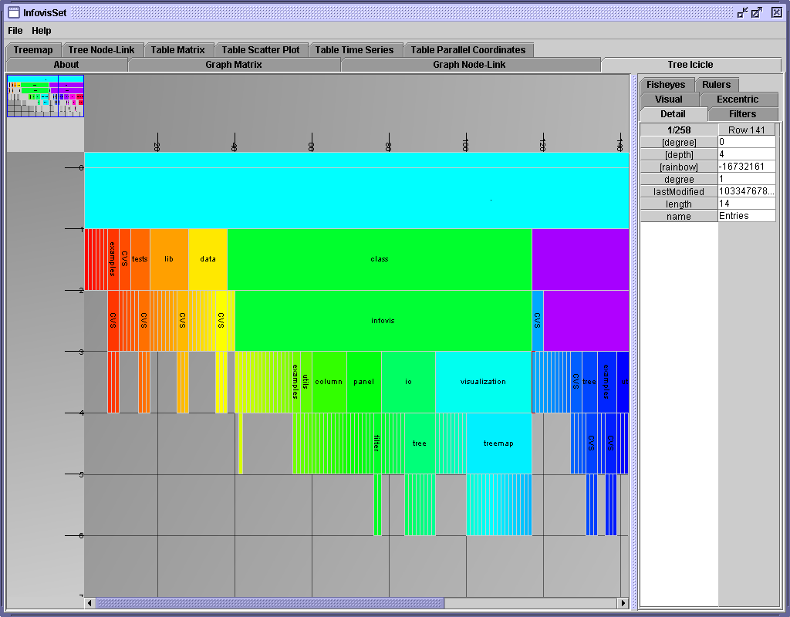
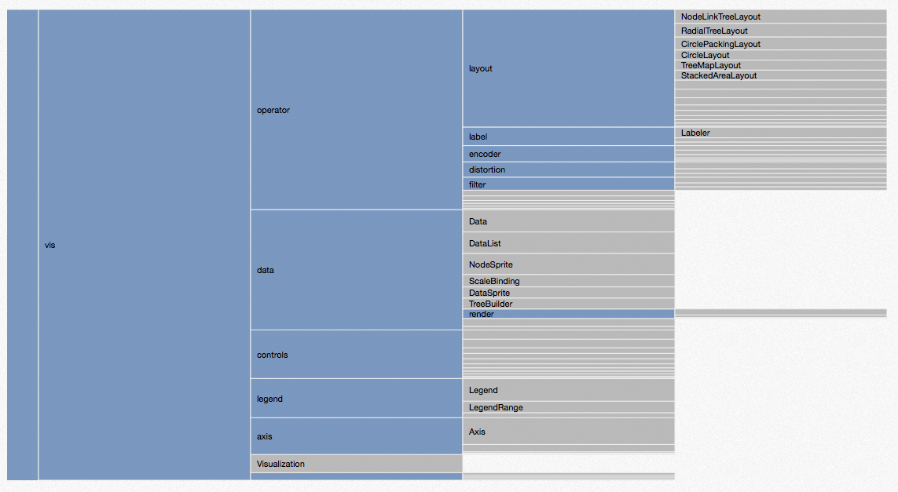

Notes about data visualization options
======================================

A pressing visualization issue is conveying how much of a given web resource (e.g., a whole domain) has been archived.  The Archivers&nbsp;2.0 Alpha currently system uses a dynamic hierarchical graph, a sample screenshot of which is shown here:

This conveys exact information about the URLs that have been archived, but it is suboptimal in both the information it conveys and its usability.  For example, a common question is “how much of ABC has been archived?” but the current graph visualization approach makes this difficult to answer.

The following are some options that have been discussed for a different visualization and data exploration interface.  Preliminary research was done by [@mhucka](https://github.com/mhucka) on behalf of [Qri.io](http://www.qri.io), and subsequent discussions over the Archivers' Slack led to additional ideas.

“Sunburst” chart
----------------

Also known as [Sunburst diagrams](http://www.datavizcatalogue.com/methods/sunburst_diagram.html), these are a common type of visualization that uses concentric rings to show hierarchy, and radial segments to show groups or categories.  Each ring corresponds to a level in the hierarchy, and the central circle represents the root.  A natural mapping for the Archivers' coverage map would be to make a single sunburst diagram correspond to a single domain (e.g., epa.gov), use concentric rings for URL hierarchies, and use segments for subdomains within the domain.  (E.g., if the root is epa.gov, a subdomain might be water.epa.gov.)

Some variations on the sunburst idea exist.  [Vesper](http://www.vesper.org.uk) provides a kind of dynamic sunburst diagram for drilling down into data.  Clicking on a piece of the diagram reveals another diagram, with intuitive animations to show the transition and filling in of new circles.  Clicking on the middle node goes back up a level to the previous sunburst diagram.  Online demos exist, and the code is open-source in GitHub:

* http://www.vesper.org.uk/vesperDemo/vesper/demoNew.html
* https://github.com/martingraham/vesper

Sunburst diagrams are also known as _bilevel partitions_ and _radial treemaps_.  An implementation of almost exactly what Vesper does is available for D3.js:

* http://bl.ocks.org/denjn5/00a57e89c67906897b6eede56219170e

“Sequence sunburst” diagrams
----------------------------

Though hierarchy is captured in a sunburst diagram by the concentric circles, path relationships can be difficult to grasp.  [@blackglade](https://github.com/Blackglade) discovered an interesting variation by Kerry Rodden: the [sequence sunburst](https://bl.ocks.org/kerryrodden/7090426) diagram.  This produces a dynamic path list in the upper left corner of the screen when the user mouses over areas of the sunburst diagram, thus making the hierarchical path explicit.

Online demos exist and the code is open-source in GitHub

* https://bl.ocks.org/kerryrodden/7090426
* Someone's improved implementation: https://gist.github.com/chrisrzhou/d5bdd8546f64ca0e4366

“Icicle trees”
-------------

*Icicle trees*, also known as [icicle charts](http://visu.al/blog/displaying_data_hierarchy_charts/#) and [partition layouts](http://mbostock.github.io/d3/talk/20111018/partition.html), are very similar to a rectangular version of sunburst diagrams.  Instead of the radial arrangement of parts, icicle trees arrangement rectangular elements linearly.  In the classical icicle tree, the orientation is vertical: the highest element is the root, and each successive layer downward represents another level in a hierarchy.  However, they can be oriented horizontally too.  An important feature of icicle trees is that the area of each rectangle in the diagram can be made proportional to some variable.

Icicle trees have a long history. A 1981 paper by [Kleiner and Hartigan](http://www.jstor.org/stable/2287820) described a "trees and castles" type of diagram that may have inspired icicle trees.  An early implementation was provided in a software package called [InfoVis](http://ivtk.sourceforge.net), back over a decade ago.  InfoVis is implemented in Java.

Although icicle trees don't appear to be as popular as sunburst diagrams, there now exist a number of implementations of this type of visualization.  There is an implementation of a zoomable icicle diagram in D3.js by Mike Bostock:

* https://bl.ocks.org/mbostock/1005873

Inspired by a [random presentation](http://www.cs.umd.edu/hcil/ehr-workshop-2010/slides/lifeflow.pdf) found by Googling around (see in particular their p.&nbsp;8), another idea is to orient icicle trees horizontally.  This should also make drawing the diagrams easier: if the widths of the rectangles are always the same, then the problem of scaling the size of different blocks reduces to the problem of changing only the heights of the blocks, because the width is constant for all blocks at each level of the hierarchy (i.e., along the horizontal axis).  So the hardest part of the implementation might be deciding what basis to use for scaling the areas.

It turns out that horizontally-oriented icicle trees are exactly what D3 calls a [partition layout](https://github.com/d3/d3-hierarchy/blob/master/README.md#partition).The examples given in the D3 API reference do not use color very much, but presumably one could enhance them further by a dash of color.

* [D3 API reference](https://github.com/d3/d3/blob/master/API.md)

For Archivers 2.0, it remains to decide what information to map to the different aspects of the diagram.  One possibility is the following:

1. put domains/subdomains on the horizontal axis (e.g., epa.gov would be the left-most column, then subdomains would be the second column, and so on moving to the right)
2. map the area of block to the amount of coverage

Miscellaneous resources
-----------------------

Random note that might be interesting to people: here are 3 catalogs of data visualization types – not software per se, but rather, visualization approaches & display types:

* http://www.datavizcatalogue.com
* http://www.visual-literacy.org/periodic_table/periodic_table.html
* http://www.vizipedia.com
  
Finally, it's worth mentioning that a 2001 survey paper found that the related visualization approach of _tree maps_ are the worst among the tree-like visualizations, and that icicle trees were as good or better than any other.  So this is some support for the idea that icicle trees are not a bad type of visualization.

> Barlow, T., & Neville, P. (2001). A comparison of 2-D visualizations of hierarchies. In IEEE symposium on information visualization (INFOVIS 2001) (pp. 131-138).
