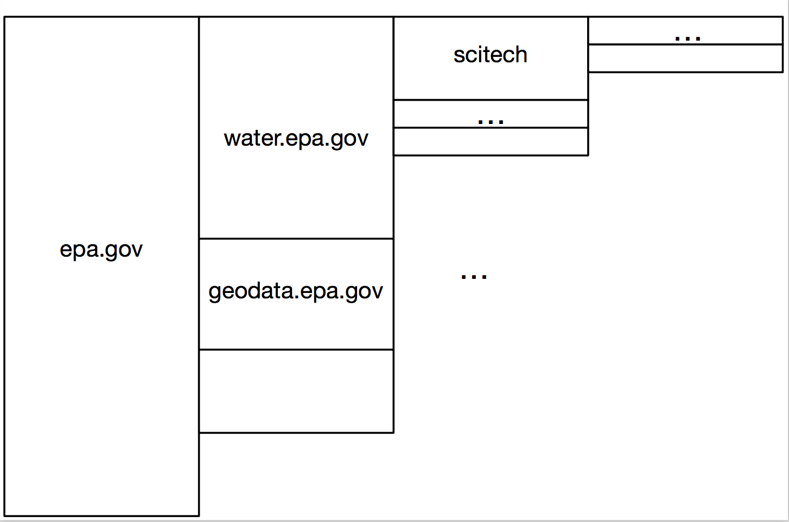

Vesper: this is a kind of dynamic sunburst diagram for drilling down into data
* http://www.vesper.org.uk/vesperDemo/vesper/demoNew.html
* https://github.com/martingraham/vesper

> Random note that might be interesting to people: here are 3 catalogs of data visualization types – not software per se, but rather, visualization approaches & display types. I find these useful when trying to figure out how to display any given data set. The rest of you have probably seen some or all of these already. (If you've come across other ones like this, please do tell!)
> - @mhucka

* http://www.datavizcatalogue.com
* http://www.visual-literacy.org/periodic_table/periodic_table.html
* http://www.vizipedia.com

Continuing on the search for ways of visualizing the coverage map, here's another idea, inspired by a combination of two things:

First, there's a type of visualization called the "Icicle Tree".  It seems to have been originated by a French researcher (Fekete) and implemented in a software package, InfoVis, back over a decade ago: http://ivtk.sourceforge.net  Their icicle trees are oriented vertically, as shown in this screenshot:

  http://ivtk.sourceforge.net/TreeIcicle.png

Although it's ugly in a the-1990's-called-and-they-want-their-Java-back kind of way, someone else used it in a horizontal way, in these slides:

  http://www.cs.umd.edu/hcil/ehr-workshop-2010/slides/lifeflow.pdf

See p.8 in particular.  Now, they used it for temporal data, so not our case, and we can ignore that.  Stepping back for a moment and looking at the horizontal orientation, though, what if one were to do the following:

  1. put domains/subdomains on the horizontal axis
  2. map size of block to amount of coverage

To show what I mean, I mocked up a really quick illustration (attached).  An interesting thing about this is that it doesn't strike as something that would be hard to implement, if there's no existing library that does it.  I think the hardest part would be figuring out how to scale the areas based on ... something ... about the coverage.  (And it's worth nothing that the drawing problem reduces to a simpler problem if the widths of the rectangles are always the same: then the problem of scaling different blocks reduces to the problem of changing the heights of the blocks, because the width is constant for all blocks.)

** ** 

Just a note that I'm wrong about the origin of icicle plots.  They go back farther.  A comparison paper in a 2001 conference is the earliest mention I've found so far, and they say icicle trees are similar to the "trees and castles" in this paper:

  http://www.jstor.org/stable/2287820

Doesn't really matter; I just wanted to correct the statement in my previous message, about the origin.

Incidentally the 2001 paper found that tree maps are the worst among the tree-like visualizations, and that icicle trees were as good or better than any other.  So this is some support for the idea that icicle trees are not a bad type of visualization.

Barlow, T., & Neville, P. (2001). A comparison of 2-D visualizations of hierarchies. In IEEE symposium on information visualization (INFOVIS 2001) (pp. 131-138).