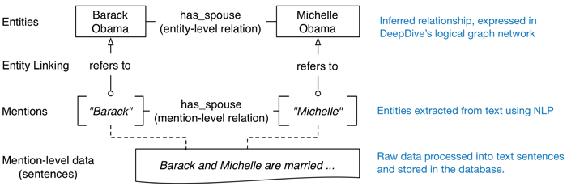

DeepDive
========

[DeepDive](http://deepdive.stanford.edu) is a collection of software systems to create a _knowledge base_ in the form of a probabilistic database.  It is a complete framework, with data processing pipeline, facilities for training the machine learning algorithm and assessing its performance during iterative improvements, and facilities for answering queries about the data in the knowledge base.  It has been applied to extracting entities and relationships from raw text; for example, from raw text corpuses it can extract such things as company-founder relationships, spouse relationships (person&nbsp;1 is the spouse of person&nbsp;2), etc.  

DeepDive is sometimes billed as a "knowledge base construction" system.  The focus of DeepDive is both to make it easier to construct knowledge bases and to make large-scale probabilistic inference and processing possible.  The input to the system is a collection of unstructured material (e.g., papers, articles in text format, etc.) and potentially also structured data sources. The output of the system is a knowledge base containing relations between the entities found in the input.  A goal of DeepDive is to make it possible for users to define how to extract entities from data sources in a way that lets the user focus on the features rather than the necessary logic to accomplish the goal.


How does it work?
-----------------

A _knowledge base_ is a collection of facts and assertions. Knowledge-based systems combine a structured database with an inference engine that can "reason" about data, for example to infer other data, detect inconsistencies, produce reports, etc.  A knowledge base differs from a plain database in having at least the following features: (1) objects have class-subclass relationships; (2) objects are connected to each other by typed links that establish relationships; and (3) rules can be defined to establish implications based on values or relationships.  Ordinary knowledge bases make absolute statements about entities and their relationships, which (as one can imagine) leads to problems in matching them up to the noisy and uncertain real world.  A _probabilistic_ knowledge base such as DeepDive puts probabilities on the values of variables rather than making absolute statements.

DeepDive's underlying framework is a variant of probabilistic graphical models known as a _factor graph_.  A DeepDive knowledge base is a big factor graph.  The variables in the graph have weights associated with them; the weights can be either assigned or learned.  DeepDive lets the user define functions and inference rules, and these are used to process input data, perform marginal inference to assign weights to relationships, and infer expected values for variables.

For example, if the system is supposed to extract putative relationships between people mentioned in text corpuses, the user might define a relationship called `has_spouse`.  This might relate pairs of entities in the database; the entities themselves can be linked to specific parts of the input data via data structures and pointers to stored text.  A specific pair of entities might be "Barack Obama" and "Michelle Obama", which then might lead to the following diagram:

<p align="center">
    
</p>

In a knowledge base such as this, there would presumably be many more entities that are inferred to satisfy the `has_spouse` relationship.  A query of the database would return a table of such entities as a result. 

The variables and relationships that constitute a factor graph for a particular application need to be defined by the user.  DeepDive uses a declarative language based on [DataLog](https://en.wikipedia.org/wiki/Datalog), which is a logic language based on Prolog (and uses a subset of Prolog syntax).  Datalog has similar expressive power as SQL, but has more of a logic programming flavor.  DeepDive's variant (called _DDlog_) adds various extensions, such as the ability to create user-defined functions for doing arbitrary data processing.


How do you use it?
------------------

The basic process of creating a knowledge base using DeepDive is roughly the following.

1. Configure it to use a database (e.g., PostgreSQL).
2. Write the application schema and rules in DDlog.  Schemas define data types for columns of a relationship table.  The following is an example of what a schema looks like:
    ```
    sentences(
        doc_id         text,
        sentence_index int,
        sentence_text  text,
        tokens         text[],
        lemmas         text[],
        pos_tags       text[],
        ner_tags       text[],
        doc_offsets    int[],
        dep_types      text[],
        dep_tokens     int[]
    ).
    ```
    The following is an example of what a rule looks like. This one defines the notion of symmetry &ndash; if person A is a spouse of person B, then B is a spouse of A.  (This example also shows a fixed weight assignment; if the weight were to be learned, a variable name would appear instead of `3.0`.)
    ```
    @weight(3.0)
    has_spouse(p1_id, p2_id) => has_spouse(p2_id, p1_id) :-
        TRUE.
    ```
3. Populate the database, using a sequence of data preprocessing and feature extraction. Feature extraction is up to the user, but can be done with some off-the-shelf tools such as natural-language processing libraries.  These can parse sentences, tag parts of speech, extract entities, and do other tasks.
4. Run the DeepDive inference system to generate a factor graph.
5. Perform feedback and correction. DeepDive has tools to overlay predictions over the input data, and let the user indicate right/wrong categorizations.  There are also error calculation tools, so that as the user iteratively refines the system, they can see how the changes affect error rates.

<p align="center">
    
</p>


What else is notable about this system?
---------------------------------------

* The professor behind the DeepDive project, Christopher Ré, received a [MacArthur Genius grant](https://www.macfound.org/fellows/943/) for his work.

* Apple recently [acquired the company](http://appleinsider.com/articles/17/05/13/apple-acquires-dark-data-specialist-lattice-data-for-200m) that Ré founded to commercialize DeepDive.

* DARPA funded work on DeepDive for six years.

* There is a _lot_ of material about DeepDive &ndash; academic papers describing the theoretical foundations, examples for different domains, full source code, lots of tutorials for using it, etc.  This is far more than most inference systems provide.


What is the potential relevance to Archivers?
---------------------------------------------

One of the biggest challenges in doing large-scale data archiving is obtaining metadata about data sets.  Humans may not be available to identify and characterize a given data set, so automation is necessary.  Inferring metadata automatically is an AI-level task.

DeepDive is intriguing for several reasons.  First, a key innovation in DeepDive development has been to make it work at large scales.  This is important if one is trying to process the web pages belonging to entire web domains at a time.  Second, it has been demonstrated on a number of applications where they extract relationships from text, and (at least according to the authors' studies) the results have exceeded the accuracy produced by humans.  This suggests that if we can define what metadata to extract, and can identify general rules for how metadata might be extracted, a DeepDive-based system may be able to infer the metadata at scale.  Third, the tools that DeepDive provides, such as MindTagger for giving feedback about extracted results, are extensible tools.  (MindTagger uses templates and AngularJS so that a user can create an interface suitable for their particular application.)


Links to more information
-------------------------

* [Full example of extracting spouse names from the news](http://deepdive.stanford.edu/example-spouse)
* [Use of DeepDive to produce family trees for Wikidata](https://meta.wikimedia.org/wiki/Research:Wikipedia_Knowledge_Graph_with_DeepD)
* [Use of DeepDive to extract mentions of genes, diseases, and phenotypes from the biomedical literature](https://academic.oup.com/bioinformatics/article/32/1/106/1742428/Large-scale-extraction-of-gene-interactions-from)
* [DeepDive home page](http://deepdive.stanford.edu) 
* [GitHub repo](https://github.com/HazyResearch/deepdive) 
